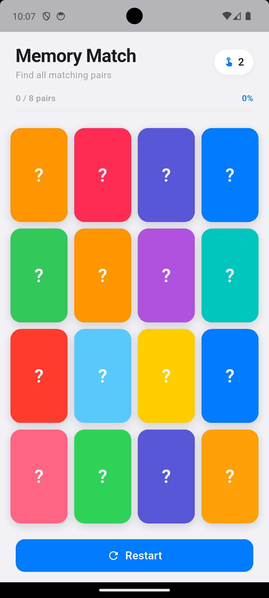
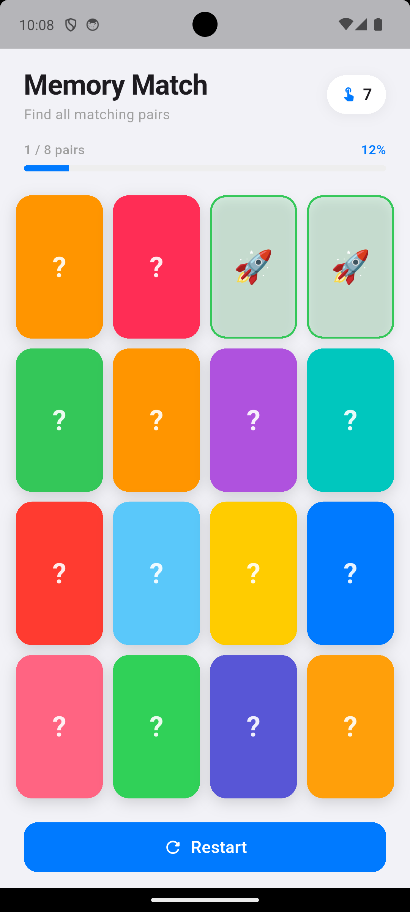
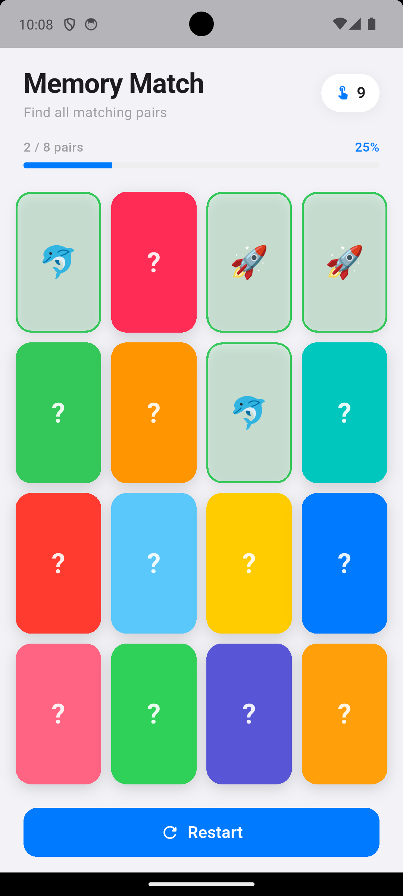
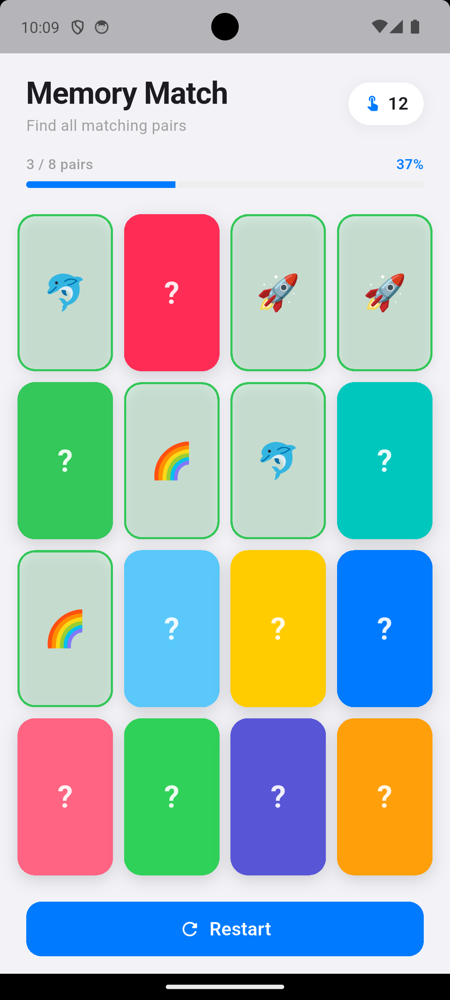
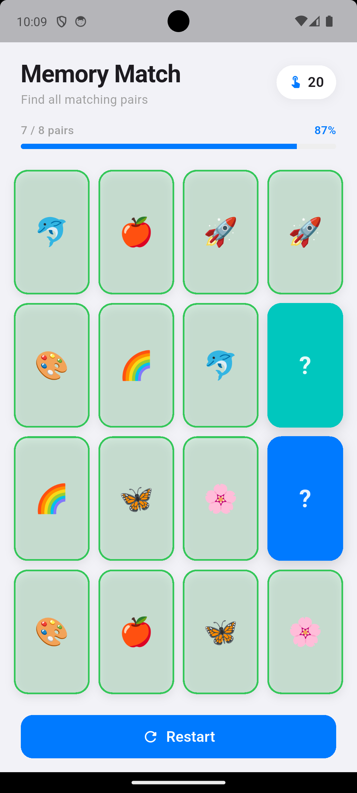
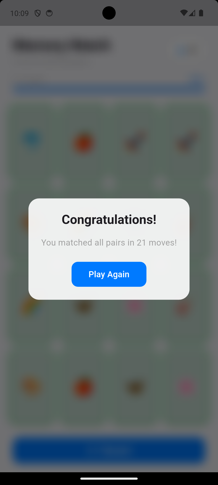

# Memory Match - Flutter App

A memory matching card game built with Flutter/Dart featuring an Apple-style UI design.

## Project Structure

```
memory_match/
+-- lib/
|   +-- main.dart          # Main game logic and UI
+-- test/
|   +-- widget_test.dart   # Widget tests
+-- screenshots/           # App screenshots
+-- web/                   # Web platform files
+-- android/               # Android platform files
+-- ios/                   # iOS platform files
+-- pubspec.yaml           # Dependencies
```

## How to Configure and Run

### Prerequisites
- Flutter SDK (3.x or later)
- Chrome browser (for web) or Android Studio / Xcode (for mobile)

### Install Dependencies
```bash
cd memory_match
flutter pub get
```

### Run on Android Emulator
```bash
flutter run -d android
```

### Run on iOS Simulator
```bash
flutter run -d ios
```

### Run on Chrome (Web)
```bash
flutter run -d chrome
```

### Build for Web
```bash
flutter build web
```

## Screenshots

### Initial State
All 16 cards are face-down in a 4x4 grid. Each card has a unique color with a "?" symbol.



### First Match Found
After flipping two matching cards (rockets), they stay revealed with a green border. The progress bar updates to show 1/8 pairs matched (12%).



### Multiple Matches
As the game progresses, more matched pairs are revealed. The move counter and progress bar track the player's progress.



### Gameplay Progress
The game adapts to different screen sizes with responsive layout. Here showing 3/8 pairs matched (37%).



### Near Completion
With 7/8 pairs matched (87%), only two cards remain face-down. The progress bar is nearly full.



### Win Dialog
When all 8 pairs are matched, a congratulations dialog appears with a blur backdrop effect, showing the total number of moves and a "Play Again" button.



## Game Features

- 4x4 grid with 8 pairs of emoji cards
- Animated card flip transitions
- Move counter to track attempts
- Progress bar showing matched pairs percentage
- Restart button to reset the game
- Win dialog with play-again option
- Apple-style UI design (SF colors, rounded corners, clean typography)
- Responsive layout adapting to different screen sizes

## Game Rules

1. All cards start face-down with colorful backgrounds
2. Tap any card to flip it over and reveal the emoji
3. Tap a second card to check for a match
4. If both cards show the same emoji, they stay revealed with a green border (matched)
5. If they don't match, both flip back face-down after 0.8 seconds
6. Find all 8 pairs to win the game
7. Try to complete the game in as few moves as possible!
